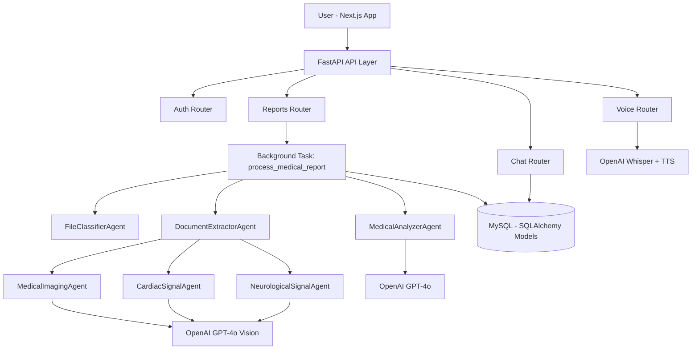
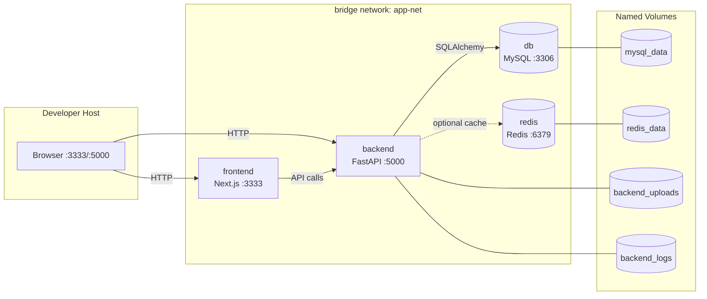

# Medical AI Analyzer

[](#roadmap)
[](./frontend/package.json)
[](#license--contact)
[](https://fastapi.tiangolo.com/)
[](https://nextjs.org/)
[](https://www.mysql.com/)
[](https://platform.openai.com/)

AI-powered medical report analysis platform that combines a FastAPI backend, a Next.js frontend, and a specialized multi-agent AI pipeline for:
- Lab report interpretation
- Medical imaging analysis (X-ray, MRI, CT, dental, ultrasound)
- Cardiac/neurological signal analysis (ECG/EKG, EEG)
- Interactive chat, streaming answers, voice transcription, and TTS

## Features
- 📄 **Multi-format intake**: Upload `PDF`, `PNG`, `JPG`, `JPEG`, and `TIFF` files.
- 🧠 **Agentic analysis pipeline**: File classifier + extractor + specialized analyzers.
- 🩻 **Imaging intelligence**: Dedicated imaging agent for radiology-style structured output.
- 🫀 **Cardiac signal support**: ECG/EKG interpretation pipeline.
- 🧬 **Neurological signal support**: EEG interpretation pipeline.
- ✍️ **Human-in-the-loop editing**: Edit extracted raw data, then reprocess analysis.
- 💬 **Context-aware medical Q&A**: Chat with report-aware responses and feedback scoring.
- ⚡ **Real-time streaming**: SSE endpoint for token-by-token chat responses.
- 🎙 **Voice features**: Whisper transcription + OpenAI TTS for report conversations.
- 📊 **Usage analytics**: Token/cost tracking by model, agent, and chat channel.
- 📑 **Professional exports**: Generate downloadable PDF reports.
- 🧭 **Traceability**: Agent execution logs with timing, model, tokens, and cost metadata.

## Architecture & Tech Stack
### High-Level Flow


### Stack Overview
| Layer | Technologies |
|---|---|
| Frontend | Next.js 14 (App Router), React 18, TypeScript, Tailwind CSS, Axios |
| Backend API | FastAPI, Uvicorn, Pydantic, SQLAlchemy, Alembic config |
| Database | MySQL 8+ via `PyMySQL` |
| Auth | JWT (`python-jose`), bcrypt password hashing |
| AI Runtime | OpenAI `gpt-4o`, Vision, Whisper (`whisper-1`), TTS (`tts-1`) |
| Document Handling | PyPDF2, Pillow, pdf2image, pytesseract |
| Reporting | ReportLab + QR code PDF generation |
| Dev Scripts | `start.sh` / `stop.sh` for local orchestration |

### Architecture Notes
- Backend uses a **layered design** (`api`, `auth`, `db`, `services`, `agents`).
- Report processing is **asynchronous** via FastAPI `BackgroundTasks`.
- Agent system uses a **shared base class + registry pattern** for extensibility.
- Chat supports both **request/response** and **SSE streaming** modes.
- Frontend uses typed API wrappers and shared contexts for auth, transitions, and report cache.

## Getting Started
### Prerequisites
- Python `3.10+`
- Node.js `18+`
- MySQL `8+`
- OpenAI API key
- Linux/macOS shell utilities (`bash`, `lsof`, `curl`)

Optional but useful for richer OCR workflows:
- `tesseract-ocr`
- Poppler utilities (`pdftoppm`, etc.)

### 1) Clone Repository
```bash
git clone <your-repo-url>
cd medical-ai-analyzer
```

### 2) Configure Backend
```bash
cd backend
python3 -m venv venv
source venv/bin/activate
pip install --upgrade pip
pip install -r requirements.txt

# Recommended extras used by the codebase
pip install reportlab qrcode[pil] email-validator

cp env.example .env
```

Edit `backend/.env` at minimum:
- `DATABASE_URL=mysql+pymysql://<user>:<password>@localhost:3306/medical_analyzer`
- `OPENAI_API_KEY=<your-key>`
- `SECRET_KEY=<secure-random-hex>`

### 3) Create MySQL Database
```sql
CREATE DATABASE medical_analyzer CHARACTER SET utf8mb4 COLLATE utf8mb4_unicode_ci;
```

### 4) Configure Frontend
```bash
cd ../frontend
npm install
printf "NEXT_PUBLIC_API_URL=http://localhost:5000/api/v1\n" > .env.local
```

### 5) Run the Platform
Recommended (from repository root):
```bash
cd ..
chmod +x start.sh stop.sh
./start.sh
```

This starts:
- Backend: `http://localhost:5000`
- Frontend: `http://localhost:3333`
- Swagger: `http://localhost:5000/docs`

Stop services:
```bash
./stop.sh
```

### 6) Health Check
```bash
curl http://localhost:5000/health
```

## Docker Deployment (Production-Grade)
### Single-Command Deployment
From the project root:
```bash
docker compose up -d --build
```

Core entrypoints:
- Frontend: `http://localhost:3333`
- Backend API: `http://localhost:5000`
- Swagger: `http://localhost:5000/docs`

Stop the stack:
```bash
docker compose down
```

Stop and remove persistent volumes:
```bash
docker compose down -v
```

### Docker Network Isolation (Runtime Topology)


### Service Mesh Table (Ports + Health)
| Service | Internal Port | External Port | Healthcheck | Status Signal |
|---|---:|---:|---|---|
| `frontend` | `3333` | `3333` | `GET /` (Node HTTP probe) | `healthy` when web UI responds |
| `backend` | `5000` | `5000` | `GET /health` (Python probe) | `healthy` when API returns 200 |
| `db` | `3306` | Internal only | `mysqladmin ping` | `healthy` when MySQL accepts auth |
| `redis` | `6379` | Internal only | `redis-cli ping` | `healthy` when `PONG` is returned |
| `adminer` (profile: `tools`) | `8080` | `8080` | none | starts after DB health dependency |

### Environment Contract (No-KeyError Boot)
Required in root `.env` (or defaults are applied):
- `MYSQL_DATABASE`
- `MYSQL_USER`
- `MYSQL_PASSWORD`
- `MYSQL_ROOT_PASSWORD`
- `SECRET_KEY`
- `OPENAI_API_KEY` (required for AI/voice features; API boot still succeeds without it)
- `NEXT_PUBLIC_API_URL` (default `http://localhost:5000/api/v1`)
- `ACCESS_TOKEN_EXPIRE_MINUTES`
- `REFRESH_TOKEN_EXPIRE_DAYS`
- `WORKERS` (default `1` for safe startup table initialization)

Example:
```bash
cat > .env <<'EOF'
MYSQL_DATABASE=medical_analyzer
MYSQL_USER=medicalai
MYSQL_PASSWORD=change-me-app
MYSQL_ROOT_PASSWORD=change-me-root
SECRET_KEY=change-me-long-random
OPENAI_API_KEY=sk-...
NEXT_PUBLIC_API_URL=http://localhost:5000/api/v1
ACCESS_TOKEN_EXPIRE_MINUTES=480
REFRESH_TOKEN_EXPIRE_DAYS=30
WORKERS=1
EOF
```

### Validation Checklist
```bash
# 1) Normalize compose config
docker compose config

# 2) Build and start
docker compose up -d --build

# 3) Observe health
docker compose ps

# 4) Verify API and UI
curl -f http://localhost:5000/health
curl -I http://localhost:3333

# 5) Full stack verification (recommended)
bash verify_stack.sh

# Optional: preserve volumes/data during verification
RESET_STACK=0 bash verify_stack.sh
```

## Usage Examples
Set base URL:
```bash
API_URL="http://localhost:5000/api/v1"
```

Register:
```bash
curl -X POST "$API_URL/auth/register" \
  -H "Content-Type: application/json" \
  -d '{
    "email":"doctor@example.com",
    "username":"doctor1",
    "password":"StrongPass123",
    "full_name":"Demo User"
  }'
```

Login (OAuth2 form data):
```bash
curl -X POST "$API_URL/auth/login" \
  -H "Content-Type: application/x-www-form-urlencoded" \
  -d "username=doctor1&password=StrongPass123"
```

Upload report:
```bash
TOKEN="<access_token>"
curl -X POST "$API_URL/reports/upload" \
  -H "Authorization: Bearer $TOKEN" \
  -F "file=@test-files/sample.pdf"
```

Check processing:
```bash
REPORT_ID="<report_id>"
curl -H "Authorization: Bearer $TOKEN" \
  "$API_URL/reports/$REPORT_ID/processing-status"
```

Ask a question:
```bash
curl -X POST "$API_URL/reports/$REPORT_ID/chat" \
  -H "Authorization: Bearer $TOKEN" \
  -H "Content-Type: application/json" \
  -d '{"question":"Which findings need immediate follow-up?"}'
```

Stream chat response (SSE):
```bash
curl -N -X POST "$API_URL/reports/$REPORT_ID/chat/stream" \
  -H "Authorization: Bearer $TOKEN" \
  -H "Content-Type: application/json" \
  -d '{"question":"Explain the abnormal findings in simple terms."}'
```

Voice transcription:
```bash
curl -X POST "$API_URL/reports/$REPORT_ID/chat/voice" \
  -H "Authorization: Bearer $TOKEN" \
  -F "audio=@voice-message.webm"
```

Download generated PDF:
```bash
curl -L "$API_URL/reports/$REPORT_ID/download-pdf" \
  -H "Authorization: Bearer $TOKEN" \
  --output medical_report.pdf
```

## API Documentation
Interactive docs:
- Swagger UI: `http://localhost:5000/docs`
- ReDoc: `http://localhost:5000/redoc`

Base path: `/api/v1`

| Domain | Endpoints |
|---|---|
| Auth | `POST /auth/register`, `POST /auth/login`, `POST /auth/refresh`, `GET /auth/me`, `POST /auth/change-password` |
| Reports | `POST /reports/upload`, `GET /reports/list`, `GET /reports/{id}`, `PUT /reports/{id}/extracted-data`, `POST /reports/{id}/reprocess`, `DELETE /reports/{id}`, `GET /reports/{id}/download-pdf` |
| Processing & Observability | `GET /reports/{id}/processing-status`, `GET /reports/{id}/agent-logs`, `GET /reports/usage-stats` |
| Chat | `POST /reports/{id}/chat`, `POST /reports/{id}/chat/stream`, `GET /reports/{id}/chat/history`, `GET /reports/{id}/chat/suggested-questions`, `POST /reports/{id}/chat/{conversation_id}/generate-title`, `POST /reports/{id}/chat/{message_id}/feedback`, `DELETE /reports/{id}/chat`, `DELETE /reports/{id}/chat/{message_id}`, `GET /reports/chat/counts`, `GET /reports/{id}/chat/stats` |
| Voice | `POST /reports/{id}/chat/voice`, `POST /reports/{id}/chat/text-to-speech` |

## Project Structure
```text
medical-ai-analyzer/
├── backend/
│   ├── app/
│   │   ├── agents/                # Base framework + specialized AI agents
│   │   ├── api/                   # auth, reports, chat, stream, voice routers
│   │   ├── auth/                  # JWT utilities and auth dependencies
│   │   ├── db/                    # SQLAlchemy engine/session/models
│   │   └── services/              # file storage + PDF generation
│   ├── env.example
│   ├── requirements.txt
│   ├── logs/
│   └── uploads/
├── frontend/
│   ├── app/                       # App Router pages (landing, auth, dashboard, reports)
│   ├── components/                # UI building blocks + report/chat components
│   ├── contexts/                  # auth/report cache/navigation state
│   ├── hooks/
│   ├── lib/                       # API client, constants, logging, env
│   └── types/
├── start.sh                       # Launches backend (:5000) + frontend (:3333)
├── stop.sh                        # Stops running services
└── README.md
```

## Contributing
Contributions are welcome. For consistent collaboration:

1. Create a feature branch from `main`.
2. Keep commits focused (`feat`, `fix`, `docs`, `refactor` style is recommended).
3. Update docs when behavior or endpoints change.
4. Validate locally:
   - Backend starts and `/health` responds.
   - Frontend runs and can authenticate + upload.
   - Core report flow (`upload -> process -> view -> chat`) works.
5. Submit a PR with:
   - Clear problem statement
   - Scope of change
   - Manual test evidence (commands/screenshots)

## Roadmap
- [x] Add Docker + Docker Compose for one-command local setup.
- [ ] Add CI pipeline (lint, type checks, backend tests, frontend tests).
- [ ] Introduce formal Alembic migration workflow and seed scripts.
- [ ] Expand provider abstraction for non-OpenAI model backends.
- [ ] Add richer observability (OpenTelemetry traces and metrics dashboards).
- [ ] Harden auth/security defaults (rate limiting, stricter CORS, audit trails).
- [ ] Increase automated test coverage across agents and API contracts.

## License & Contact
### License
Current repository state does not include a top-level `LICENSE` file.  
Before external distribution, add an explicit license file (MIT or your preferred license) to define legal usage terms.

### Contact
- For support and issues, use your project hosting issue tracker (or internal engineering channel if this is private).
- For feature requests, open a ticket with: use case, expected behavior, and sample input/output.

---

## Medical Disclaimer
This project provides AI-generated analysis for informational support. It is **not** a medical device and does **not** replace diagnosis or treatment by licensed healthcare professionals.
